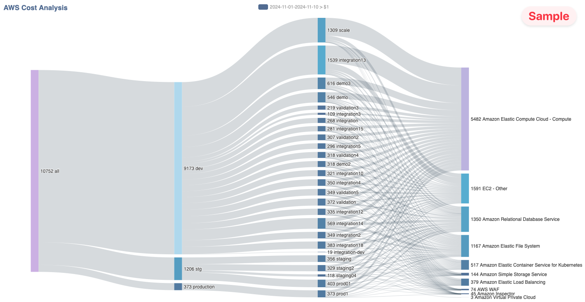

# aws-cost-sankey
Generate Sankey chart from AWS Cost Explorer

This Golang program provides a visual representation of AWS costs using a Sankey chart.
It helps users understand their AWS spending by capturing and aggregating cost data from multiple accounts,
and then visualizing it in an easy-to-understand format.

## Features
- **Multi-Account Support**: Capture AWS cost data from one or more accounts.
- **Data Aggregation**: Aggregate cost data by account, `environment` tag, and service type.
- **Cost Filtering**: Filter out links with aggregated costs lower than a specified threshold.
- **Sankey Chart Generation**: Generate a Sankey chart to visualize the cost data.
- **Developer mode**: Show detailed usage type instead of service

## Sample


## Prerequisites
- **Install asdf tool**

  Check https://asdf-vm.com/guide/getting-started.html for installation guides.

- **Install asdf plugins and versions**
  ```bash
  make tools
  ```

## How to Use
- **Build the Code**
  ```bash
  make build
  ```
- **Update the Config File**
  - Copy `configs/configs.example.yaml` to `configs/configs.yaml`
  - Edit `configs/configs.yaml`
    - Fill in AWS credentials, including `AWS_ACCESS_KEY_ID`, `AWS_SECRET_ACCESS_KEY`, and `AWS_SESSION_TOKEN`
    - Modify the date range as needed
    - (Optional) Adjust the link display threshold, canvas height, and width
- **Run the Code**
  ```bash
  ./build/aws-cost-sankey
  ```
  This will generate `output.html` at current folder

  For more advanced parameters, see
  ```bash
  ./build/aws-cost-sankey --help
  ```

## Contributions
Contributions are welcome! Please fork the repository and submit a pull request.

## License
This project is licensed under the MIT License. See the `LICENSE` file for details.
